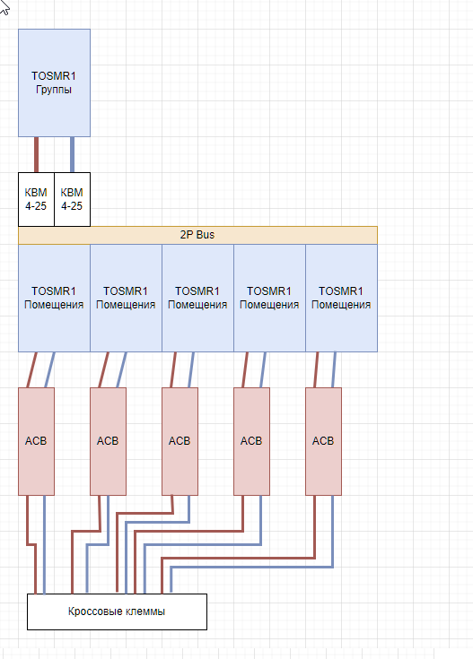

# Электрика

## Содержание
- [Электрика](#электрика)
  - [Содержание](#содержание)
  - [1. Силовые сети](#1-силовые-сети)
    - [1.1. Вводная группа](#11-вводная-группа)
    - [1.2. Щитовое оборудование](#12-щитовое-оборудование)
    - [1.3. Защита и автоматика](#13-защита-и-автоматика)
    - [1.4. Список оборудования](#14-список-оборудования)
    - [1.5. Требования к монтажу](#15-требования-к-монтажу)
  - [2. Силовые сети и проводка](#2-силовые-сети-и-проводка)
    - [2.1. Общие принципы и материалы](#21-общие-принципы-и-материалы)
    - [2.2. Типы кабелей](#22-типы-кабелей)
      - [2.2.1. Кабели переменного тока (AC)](#221-кабели-переменного-тока-ac)
      - [2.2.2. Кабели постоянного тока (DC)](#222-кабели-постоянного-тока-dc)
      - [2.2.3. Data-кабели (для каждой комнаты)](#223-data-кабели-для-каждой-комнаты)
    - [2.3. Монтаж и организация проводки](#23-монтаж-и-организация-проводки)
      - [2.3.1. Прокладка кабелей](#231-прокладка-кабелей)
      - [2.3.2. Соединения и оконцовка](#232-соединения-и-оконцовка)
      - [2.3.3. Распиновка](#233-распиновка)
  - [3. Аварийное освещение](#3-аварийное-освещение)
  - [4. Освещение](#4-освещение)

## 1. Силовые сети

### 1.1. Вводная группа
- **АВДТ (Автоматический выключатель дифференциального тока):** Рекомендуется использование устройств Tongou с управлением по протоколу Modbus.
  - **Артикул (SKU):** Tongou TOSMR1
  - **Ключевые характеристики:**
    - Номинальный ток: 40A (программируемо)
    - Ток утечки: 30mA
    - Количество полюсов: 2P
    - Интерфейс управления: Modbus RTU
    - Время отключения: ≤ 30мс
- **Схема подключения групп помещений:** Общий АВДТ TOSMR1 на DIN-рейке → Блок АВДТ TOSMR1 для отдельных помещений → Двухполюсные автоматические выключатели (например, ABB 2P ACB) для конечных групп → Клеммы WAGO (например, 285-1102) для подключения. 

- **Группы потребителей:** Электрическая система должна быть разделена на следующие основные группы:
  - Освещение
  - Розеточные группы
  - Силовые потребители (например, варочная панель, духовой шкаф)
  - Специализированные нагрузки (кондиционеры, стиральная машина, бойлер и т.д.)

- **Контролллеры и управление:** Рекомендуется использование ESP-модуля от Eletech.
  - **Модель:** ESC3B04  (либо аналогичный Eletech)
  - **Артикул (SKU):** Eletech ESC3B04 Module
  - **Основные функции:**
    - Управление по протоколу Modbus
    - Мониторинг состояния электрических групп
    - Ведение журнала событий (логирование)
    - Управление контакторами
    - Релейное управление

### 1.2. Щитовое оборудование
 - Предпочтительное использование многожильных проводов для удобства монтажа и возможных доработок системы
 - Использование пластиковых перфорированных коробов для организации горизонтальной и вертикальной прокладки многожильных кабелей внутри щитка
 - Применение 2P-шин для объединения модульных устройств
-  Использование специализированных вводных клемм (КВМ) для подключения питания к распределительным шинам (гребенкам)
-  Распределение нулевых (N) и фазных (L) проводников по разным сторонам (или DIN-рейкам) щитка в соответствии с ПУЭ
-  Все кабели внутри щитка должны подключаться от модульных устройств непосредственно к кроссовым клеммам
-  В щиток входит он RJ-45 и один RJ-12 кабель, которые идут в серверную
-  **Клеммы WAGO:** Все соединения в электрическом щитке должны выполняться с использованием DIN-клемм WAGO
     - **Кроссовые клеммы WAGO:**
       - **Расположение:** В верхней и нижней частях щитка
       - **Назначение:** Для ввода и вывода кабелей из щитка, для обеспечения полного демонтажа щитка с легким отключением магистралей
       - **Артикул (SKU):** WAGO 261 (или аналогичный)
     - **Остальные** : клеммы WAGO серии 2002 цвета соответствующего проводнику - синий для нейтрали, серый для линии и т.д.
  

### 1.3. Защита и автоматика
- **Защита вводной группы и общие принципы защиты:**
  - **Компоненты вводной группы (последовательность подключения):** Вводные клеммы (например, WAGO 285) → УЗИП → РКН → Главный АВДТ TOSMR1 → Селективный АВДТ (с временем срабатывания > 30мс) → Реле контроля напряжения → Устройство защиты от дугового пробоя (УЗДП Меандр) с байпассом (ACB).
  - Основная рабочая защита - TOSMR1, т.к. имеет удаленное управление, в случае несрабатывания - резерв через АВДТ и РКН.
- **Защита отдельных групп:**
  - **Осветительные сети:**
    - Защита: АВДТ 10А либо 16A (для групп освещения) - согласно нагрузке
    - Все светильники должны иметь заземление
    - Ванная команата должна иметь систему уравнивания потенциалов.

### 1.4. Список оборудования

- **Оборудование помещений:**
  - **Точки доступа Wi-Fi:** Mikrotik, с установкой в потолочной панели. Питание осуществляется по PoE
  - **Стандарт POE:** 802.3af/at
  - **Пассивные PoE-сплиттеры/коммутаторы:** Для разделения питания и данных, если требуется для оконечных устройств
  - **Датчики движения:** Пассивные инфракрасные (PIR) Zigbee (TODO: уточнить на наличие датчиков со стационарным питанием) датчики для определения дижения.
  - **Датчики присутствия:** Микроволновые (MMWave) Zigbee датчики с питанием по 220v для определения присутствия : MTG075-ZB-RL.
  - **Датчики открытия (герконы):** Для дверей и окон, с подключением к цифровым входам (DI) Modbus-шлюза или другого контроллера
- **Щитки и боксы:**
  - Для DIN-монтажа используются щитки с съемной рамой
  - Для монтажа SCADA блоков (без DIN) используются щитки со съемной монтажной панелью.
  - Блоки на местах, которые не целесообразно помещать в щитки, помещаются либо в негорючие ПВХ коробки для разводки (DKC либо соответствующие модели IEK или аналогичный, никакого "Леруа"), либо в специализированные боксы. При выборе стоит обратить внимание на алюминиевые боксы Gainta, стоимость которых схожа со стоимостью ПВХ коробок. Выводы в случае алюминиевых боксов осуществляются через резьбовые сальники.
- **Блоки питания:** Используются блоки MeanWell

### 1.5. Требования к монтажу
- **Маркировка:** Все соединения, кабели и модульные устройства должны быть четко промаркированы согласно проектной документации
- **Идентификация групп:** Каждая электрическая группа должна иметь однозначную идентификацию на автоматических выключателях и клеммах
- **Резерв для расширения:** Необходимо предусмотреть свободное место в щитке (не менее 15-20% от общего объема) для возможного расширения системы в будущем

## 2. Силовые сети и проводка

### 2.1. Общие принципы и материалы
- Прокладка магистралей: в полипропиленовых (?) трубах.
- Соответствие ПУЭ: использование рекомендованных кабелей (Магистральная проводка осуществляется кабелями, а не проводами (в соответствии с ПУЭ) т.е. никакого ПВС даже на низковольтную проводку, обсуждаемо красно-черный не CCA, но точно никакого ПВС).
- Низковольтная шина: предусмотреть 24В.
- Для низковольтной прокладки до потребителей используются луженые многоцветные провода.
- Использование омедненных проводов (CCA) в проекте категорически запрещено.
- Прокладка проводов в стенах, в т.ч. до потребителей, осуществляется в трубах для обеспечения демонтажа.

### 2.2. Типы кабелей

Производитель кабелей и проводов согласовывается с заказчиком.
#### 2.2.1. Кабели переменного тока (AC)
- Стационарные: ВВГ (NYM) 3-жильные.
#### 2.2.2. Кабели постоянного тока (DC)
- Стационарные: 2-жильные (Цветовая маркировка: Белый - плюс, Синий - минус), либо красно-черный.

#### 2.2.3. Data-кабели (для каждой комнаты)
- 1x 4p CAT5e SFTP : Питание и низкоскоростные потребители (камеры, SCADA-блкои).
- 1x 4p CAT6 SFTP : Точки доступа.
- 1x 2p SFTP (Modbus)

### 2.3. Монтаж и организация проводки

#### 2.3.1. Прокладка кабелей

- **Разводка по комнатам:**
    - Ввод кабелей: в области потолка.
    - Активное оборудование, распаячные коробки устанавливаются помещения с доступом через ревизионный люк в натяжном потолке - либо на панели люка либо над люком.
    - Проводка к оборудованию на люке (БП, диммеры): На самом ревизионном люке устанавливается AC и DC активное оборудование - блоки питания, диммеры (при наличии). Проводка к оборудованию смонтированному на люке осуществляется многожильными кабелями. 
    - Схема подводки к люку : трасса подходит к коробке на потолке, внутри коробки - переход одножильный-многожильный, многожильный кабель идет к оборудованию в люке.
- **Data-кабели:**
    - Заводка в распаячную дата-коробку).
    - Подключение оконечных устройств: мягкие кабели (патч-корды).
    - Соединения внутри коробки: "бочонки" (соединители).

#### 2.3.2. Соединения и оконцовка

- **Силовые кабели:**
  - Внутри распаячных коробок: WAGO 221 для мягкий-жесткий. 773-2273 с пастой для жесткий-жесткий.
- **Многожильные провода:**
  - Обязательная оконцовка наконечниками НШВИ.

#### 2.3.3. Распиновка

- **Modbus:** [Распиновка RJ-11]([https://](https://github.com/AlexMKX/modbus/blob/main/rj11-pinout.md))
- **Посты:** Распиновка должна быть единой по всей квартире и соответствовать распиновке щитка. Если линия в щитке справа - в посты заводится в правый контакт и т.д.

## 3. Аварийное освещение

Возле щитков и в темных помещениях установить аварийные аккумуляторные светильники, активирующиеся при проадании электричества.

## 4. Освещение
_В настоящий момент на рынке не распространены широко качественные диммируемые светодиодные лампы на 220v. Качество диммируемых ламп на 12-24v так же оставляет желать лучшего._
В проекте применяется 2 типа освещения : 
  - Основное, не диммируемое. Управляется через реле, при необходимости, лампы сгруппированы для раздельного управления.
  - Диммируемое. В помещениях, требующих использования диммера (спальня, кабинеты, гостиная, коридоры, туалет) диммирование осуществляется за счет использования 24V RGBW лент в дополнение к основному освещению. В темное время суток будет использоваться красный либо близкий к красному свет для снижения влияния на циркадные ритмы.
